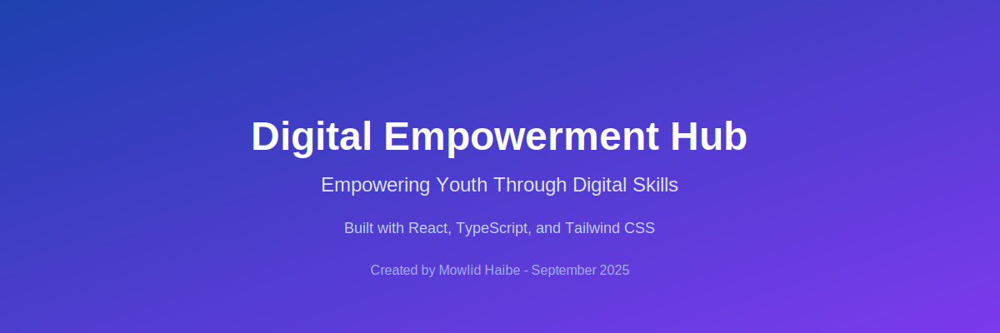

# 🌟 Digital Empowerment Hub - Student Dashboard

A comprehensive digital skills learning platform empowering marginalized youth through technology, mentorship, and community-based education.



## 📋 Table of Contents

- [About](#about)
- [Features](#features)
- [Architecture](#architecture)
- [Screenshots](#screenshots)
- [Getting Started](#getting-started)
- [Installation](#installation)
- [Usage](#usage)
- [Technologies Used](#technologies-used)
- [Contributing](#contributing)
- [License](#license)
- [Contact](#contact)

## 🎯 About

**Digital Empowerment Hub** is a transformative initiative that provides marginalized youth with access to digital skills, mentorship, and community-based learning opportunities. Our mission is to bridge the digital divide and create sustainable pathways for young people to access technology education and career opportunities.

### 🚀 Our Vision

We start by setting up sustainable learning hubs powered by technology and local trainers, then scale through a volunteer-to-mentor system. The goal is to empower young people with practical skills, connect them to opportunities, and create a cycle where graduates give back—making the program self-sustaining and impactful.

### 🎯 Key Objectives

- **Skill Development**: Provide comprehensive digital literacy and technical skills training
- **Community Building**: Foster a supportive learning environment through peer collaboration
- **Mentorship**: Connect learners with experienced professionals and successful graduates
- **Sustainability**: Create a self-sustaining ecosystem where graduates become mentors
- **Opportunity Access**: Bridge the gap between skills and employment/entrepreneurship opportunities

## ✨ Features

### 🎓 For Students
- **Interactive Dashboard**: Personalized learning experience with progress tracking
- **Course Management**: Access to diverse digital skills courses
- **Progress Analytics**: Visual representation of learning journey and achievements
- **Community Forum**: Peer-to-peer learning and support
- **Mentorship Matching**: Connect with industry professionals and alumni
- **Certificate Management**: Digital certificates and skill validation

### 👨‍🏫 For Instructors
- **Course Creation**: Intuitive tools for developing and managing course content
- **Student Progress Monitoring**: Real-time insights into student performance
- **Assessment Tools**: Comprehensive evaluation and feedback systems
- **Resource Library**: Access to teaching materials and best practices

### 🏢 For Administrators
- **Hub Management**: Oversee multiple learning centers and their operations
- **Analytics Dashboard**: Comprehensive insights into program effectiveness
- **Resource Allocation**: Manage equipment, instructors, and learning materials
- **Impact Measurement**: Track program success and community impact

## 🏗️ Architecture

### System Overview

```
┌─────────────────────────────────────────────────────────────────────┐
│                    Digital Empowerment Hub                         │
├─────────────────────────────────────────────────────────────────────┤
│                                                                     │
│  ┌─────────────────┐  ┌─────────────────┐  ┌─────────────────┐    │
│  │   Frontend      │  │    Backend      │  │    Database     │    │
│  │   (React TS)    │  │   (Node.js)     │  │   (MongoDB)     │    │
│  │                 │  │                 │  │                 │    │
│  │ • Student UI    │  │ • REST APIs     │  │ • User Data     │    │
│  │ • Admin Panel   │  │ • Auth System   │  │ • Course Data   │    │
│  │ • Instructor    │  │ • File Upload   │  │ • Progress      │    │
│  │   Dashboard     │  │ • Real-time     │  │ • Analytics     │    │
│  └─────────────────┘  └─────────────────┘  └─────────────────┘    │
│                                                                     │
├─────────────────────────────────────────────────────────────────────┤
│                        Core Components                             │
├─────────────────────────────────────────────────────────────────────┤
│                                                                     │
│  ┌─────────────────┐  ┌─────────────────┐  ┌─────────────────┐    │
│  │   Learning      │  │   Community     │  │   Analytics     │    │
│  │   Management    │  │   Platform      │  │   Engine        │    │
│  │                 │  │                 │  │                 │    │
│  │ • Course Mgmt   │  │ • Forums        │  │ • Progress      │    │
│  │ • Assessments   │  │ • Mentorship    │  │ • Performance   │    │
│  │ • Certificates  │  │ • Peer Support  │  │ • Impact Metrics│    │
│  └─────────────────┘  └─────────────────┘  └─────────────────┘    │
│                                                                     │
├─────────────────────────────────────────────────────────────────────┤
│                      Infrastructure                                │
├─────────────────────────────────────────────────────────────────────┤
│                                                                     │
│  ┌─────────────────┐  ┌─────────────────┐  ┌─────────────────┐    │
│  │   Deployment    │  │   Monitoring    │  │   Security      │    │
│  │                 │  │                 │  │                 │    │
│  │ • Cloud Hosting │  │ • Error Tracking│  │ • Authentication│    │
│  │ • CDN           │  │ • Performance   │  │ • Data Privacy  │    │
│  │ • Auto Scaling  │  │ • User Analytics│  │ • HTTPS/SSL     │    │
│  └─────────────────┘  └─────────────────┘  └─────────────────┘    │
│                                                                     │
└─────────────────────────────────────────────────────────────────────┘
```

### Technology Stack

#### Frontend
- **Framework**: React 18 with TypeScript
- **Styling**: Tailwind CSS v4 (Alpha)
- **UI Components**: Radix UI Primitives
- **State Management**: React Context API
- **Build Tool**: Vite
- **Icons**: Lucide React

#### Backend (Planned)
- **Runtime**: Node.js
- **Framework**: Express.js / Fastify
- **Database**: MongoDB / PostgreSQL
- **Authentication**: JWT / OAuth 2.0
- **File Storage**: AWS S3 / Cloudinary

#### DevOps & Deployment
- **Version Control**: Git
- **CI/CD**: GitHub Actions
- **Hosting**: Vercel / Netlify (Frontend), AWS / Railway (Backend)
- **Monitoring**: Sentry for error tracking

## 📸 Screenshots

### Student Dashboard

*Modern, intuitive interface for students to track their learning progress*

### Course Overview

*Comprehensive course catalog with interactive learning modules*

### Admin Panel

*Powerful analytics and management tools for administrators*

### Mobile Experience

*Fully responsive design optimized for all devices*

### Learning Hub Interface

### Learning Hub Interface

*Interactive learning environment with multimedia content*

## 🚀 Getting Started

### Prerequisites

Before you begin, ensure you have the following installed:
- **Node.js** (version 18.0.0 or higher)
- **npm** (version 8.0.0 or higher)
- **Git** for version control

### Installation

1. **Clone the repository**
   ```bash
   git clone https://github.com/yourusername/digital-empowerment-hub.git
   cd digital-empowerment-hub
   ```

2. **Install dependencies**
   ```bash
   npm install
   ```

3. **Set up environment variables**
   ```bash
   cp .env.example .env
   # Edit .env file with your configuration
   ```

4. **Start the development server**
   ```bash
   npm run dev
   ```

5. **Open your browser**
   Navigate to `http://localhost:3000` to view the application.

### Available Scripts

- `npm run dev` - Start development server
- `npm run build` - Build for production
- `npm run preview` - Preview production build
- `npm run lint` - Run ESLint
- `npm run lint:fix` - Fix ESLint issues
- `npm run type-check` - Type check without emitting

## 🛠️ Usage

### For Students
1. **Registration**: Create an account using your email
2. **Profile Setup**: Complete your learning profile and goals
3. **Course Enrollment**: Browse and enroll in available courses
4. **Learning Journey**: Follow structured learning paths with interactive content
5. **Progress Tracking**: Monitor your advancement through detailed analytics
6. **Community Engagement**: Connect with peers and mentors

### For Administrators
1. **Hub Management**: Set up and manage learning centers
2. **User Management**: Oversee student and instructor accounts
3. **Content Management**: Approve and organize course materials
4. **Analytics Review**: Monitor program effectiveness and impact
5. **Resource Planning**: Allocate resources and plan expansions

## 🔧 Technologies Used

### Frontend Technologies
- **React 18**: Modern React with hooks and concurrent features
- **TypeScript**: Type-safe JavaScript for better development experience
- **Tailwind CSS v4**: Utility-first CSS framework
- **Vite**: Fast build tool and development server
- **Radix UI**: Accessible, unstyled UI components
- **Lucide React**: Beautiful, customizable icons

### Development Tools
- **ESLint**: Code linting and quality assurance
- **Prettier**: Code formatting
- **Husky**: Git hooks for quality control
- **Jest**: Unit testing framework
- **Cypress**: End-to-end testing

## 🤝 Contributing

We welcome contributions from the community! Here's how you can help:

### Getting Started
1. Fork the repository
2. Create a feature branch (`git checkout -b feature/AmazingFeature`)
3. Commit your changes (`git commit -m 'Add some AmazingFeature'`)
4. Push to the branch (`git push origin feature/AmazingFeature`)
5. Open a Pull Request

### Contribution Guidelines
- Follow the existing code style and conventions
- Write clear, concise commit messages
- Include tests for new features
- Update documentation as needed
- Respect the Code of Conduct

### Types of Contributions
- **Bug fixes**: Help us squash bugs and improve stability
- **Feature development**: Add new functionality to enhance the platform
- **Documentation**: Improve docs, write tutorials, create guides
- **UI/UX improvements**: Enhance the user experience and interface
- **Testing**: Add tests to improve code coverage and reliability

## 📄 License

This project is licensed under the MIT License - see the [LICENSE](LICENSE) file for details.

### MIT License Summary
```
Copyright (c) 2023 Mowlid Haibe - Digital Empowerment Hub

Permission is hereby granted, free of charge, to any person obtaining a copy
of this software and associated documentation files (the "Software"), to deal
in the Software without restriction, including without limitation the rights
to use, copy, modify, merge, publish, distribute, sublicense, and/or sell
copies of the Software, and to permit persons to whom the Software is
furnished to do so, subject to the following conditions:

The above copyright notice and this permission notice shall be included in all
copies or substantial portions of the Software.

THE SOFTWARE IS PROVIDED "AS IS", WITHOUT WARRANTY OF ANY KIND, EXPRESS OR
IMPLIED, INCLUDING BUT NOT LIMITED TO THE WARRANTIES OF MERCHANTABILITY,
FITNESS FOR A PARTICULAR PURPOSE AND NONINFRINGEMENT. IN NO EVENT SHALL THE
AUTHORS OR COPYRIGHT HOLDERS BE LIABLE FOR ANY CLAIM, DAMAGES OR OTHER
LIABILITY, WHETHER IN AN ACTION OF CONTRACT, TORT OR OTHERWISE, ARISING FROM,
OUT OF OR IN CONNECTION WITH THE SOFTWARE OR THE USE OR OTHER DEALINGS IN THE
SOFTWARE.
```

## 📞 Contact

### Project Creator
**Mowlid Haibe**  
*Digital Empowerment Hub Founder & Lead Developer*
- 📧 Email: [malitmohamud@gmail.com](mailto:malitmohamud@gmail.com)
- 🌐 LinkedIn: [Connect with me](https://linkedin.com/in/mowlid-haibe)
- 🐙 GitHub: [@mowlid-haibe](https://github.com/mowlid-haibe)

### Project Information
- **Project Start Date**: September 23, 2025
- **Current Version**: 1.0.0
- **Status**: Active Development
- **Project Repository**: [Digital Empowerment Hub](https://github.com/yourusername/digital-empowerment-hub)

---

## 🙏 Acknowledgments

- **Community Partners**: Local organizations supporting digital literacy
- **Mentors**: Industry professionals volunteering their time
- **Open Source**: Contributors to the libraries and frameworks we use
- **Beta Testers**: Early users who provided valuable feedback

---

## 📊 Project Stats


---

**Built with ❤️ for empowering youth through digital education**

*"Empowering the next generation with digital skills and opportunities"*